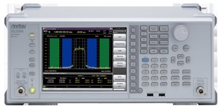
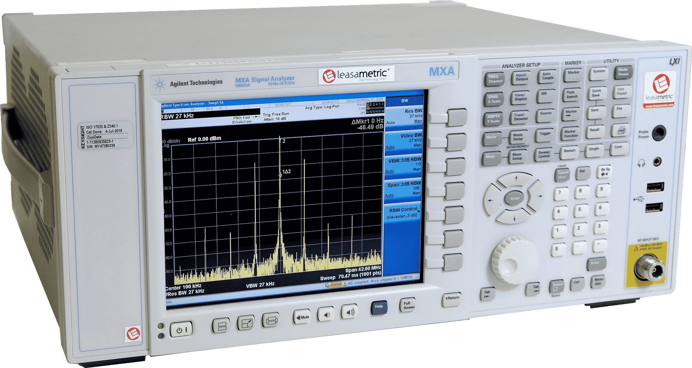

# Python Libraries to manage Anritsu-MS2830A & Agilent-N9020A machines


## Project Summary 📃

Python libraries developed to control Anritsu MS2830A and Agilent N9020A machines remotely via Ethernet.


    


## Starting 🚀

_These instructions will allow you to get a working copy of the project on your local machine for development and testing purposes.._


### Pre requirements 📋

* Python version used during development : **3.9.13**
* Version of pip used during development: **22.1.2**


### Installation 🔧

Here we will see how to download the dependencies so that our libraries work.
Possible modes of use depending on the version of pip you have:

```
pip install -r requirements.txt
```

or
```
pip3 install -r requirements.txt
```


## Built with 🛠️

* [Python](https://www.python.org/) - Programming language used
    * [PyVISA](https://pyvisa.readthedocs.io/en/latest/) - Tool used to create the libraries with which to control Anritsu MS2830A and Agilent N9020A machines via Ethernet


## Author ✒️

* **Salvador Jesús Megías Andreu** - [salvadorJMA](https://github.com/salvadorJMA)


## License 📄

This project is licensed under the MIT License - see the [LICENSE](LICENSE) file for details

## Expressions of Gratitude 🎁

* Tell others about this project 📢


---
⌨️ with ❤️ by [Salvador Megías Andreu](https://github.com/salvadorJMA) 😊
